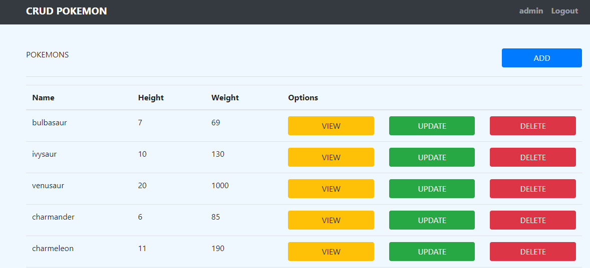

# CRUD-POKEMON

## Questões:

1)Uma maneira simples é a utilização da função concat do pandas, outra maneira seria inserindo um segundo dataframe em outro.

2)Variáveis locais são definidas em funções e somente podem ser utilizadas nesse escopo. Variáveis globais são definidas fora de funções e podem ser utilizadas em qualquer escopo.  

3)Em Python se possui muitas referências de valores, onde tendo uma lista=[1,2,3] e outra lista2 = lista, nesse caso eu tenho duas variáveis apontando para o mesmo dado. Para realizar uma cópia de fato é necessário a utilização da função copy(), onde agora teremos as duas listas apontando para dados diferentes. Dataframes seguem a mesma lógica da lista, sendo necessário o uso da função copy() para multiplicar o dataframe.

4)Caso o Flask esteja sem nenhuma configuração e 2 requisições sejam processadas, a 2° requisição irá ser bloqueada enquanto a 1° estiver sendo executada. É possível resolver utilizando multi-thread, onde agora as 2 requisição serão executadas de maneira simultânea.

5)É um processo de manter o mesmo conjunto de dados, sendo utilizado como redundância nos dados.

6)São consultas ao banco de dados, onde essas consultas podem ter 2 resultados possíveis(sucesso ou falha), tendo como 1 resultado possível a falha, reverter uma consulta é essencial para manter a integridade dos dados.

## Para executar:

```sh
python app.py
``` 
O projeto pode ser encontrado e testado em: https://crud-pokemon.herokuapp.com

O projeto é desenvolvido em Python com a utilização do Flask. As informações dos pokemons foram retiradas de https://pokeapi.co .Cada pokemon possui muitas informações, assim sendo, somente algumas informações foram utilizadas para as funções de ADD, UPDATE e DELETE 



